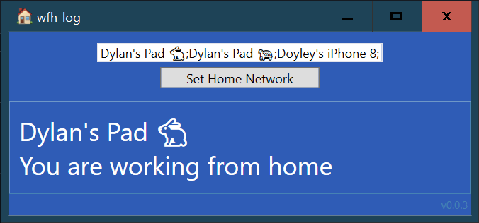

# work from home log
A wpf app to log work from home hours for the Australian Tax Office (ATO)

## Installation
This app only works on Windows.

### Run at startup
1. Download the wfh-log.exe from releases
2. Select Start Menu and type 'run'
3. Open `shell:startup`
4. Place the wfh-log.exe here

## Usage
1. Enter the name of your home network
2. Save

## Logs
The application logs once at startup and every hour.

The log will be in location:
`c:\users\dylan\appdata\local\wfh-log`

## A note on the ATO
You only need a 4 week log to claim the fixed rate method for working from home expenses.

